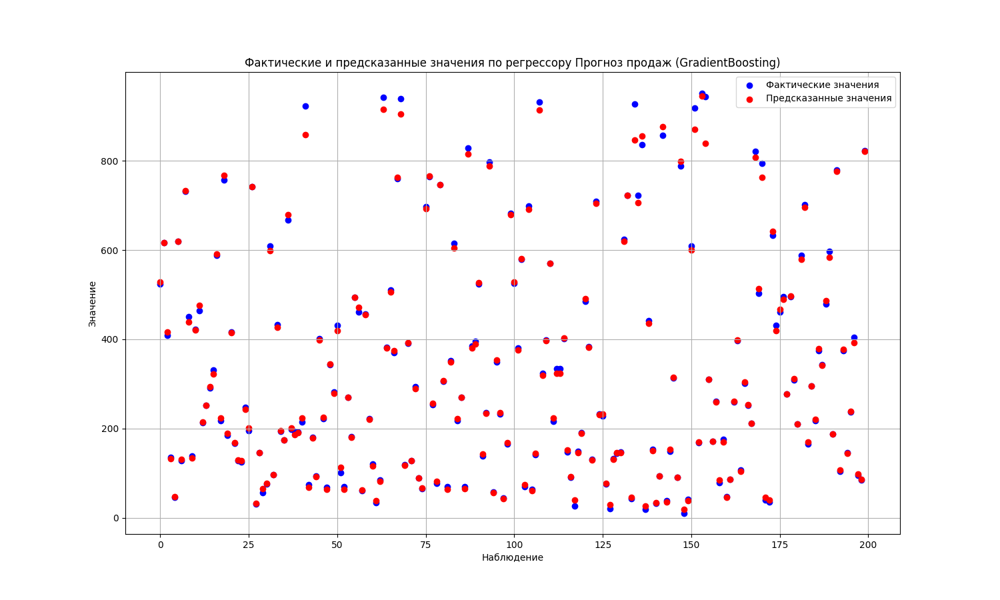

Домашнее задание 1
=====================

# Условие:

- Загрузите набор данных о продажах товаров в супермаркете и создайте модель регрессии для прогнозирования продаж.

# Датасет

Датасет взят по ссылке <https://www.kaggle.com/datasets/lovishbansal123/sales-of-a-supermarket>

# Модули

- data_loader.py для открытия файла CSV
- data_visual.py для визуализации графиков
- log.py для логирования

# Полученные графики

Все графики находятся в папке out_jpg.
1.  

В папке v1 находится проект, который в работу брался первый, но его реализация мне не понравилась